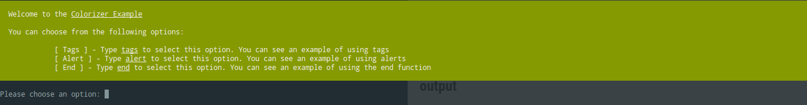
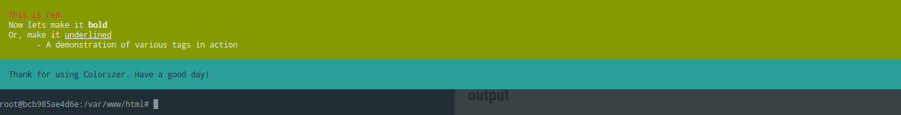

# :art: Colorizer 

The nifty PHP class to add some color to your boring terminal output.

> This is an example of a dialogue screen generated on BASH terminal screen using `Colorizer`
> 


> This is another example of the `Colorizer`
> 


The primary features of this class are in its **fluidity** and *simplicity*.

#### Example Code

```php
$colorizer = new Colorizer(`tput cols`,"green", "white");
$colorizer->clear();
$colorizer->addMessage("Welcome to the [u]Colorizer Example[/u]")->newLn();
$colorizer->spit();

```

Simple. While this code is pretty self-explanatory, yet I would go ahead make it more sensible.

- **Initialization of the constructor**
	The paramters are 
    1. Screen Width (or any width in terms of number of columns that you want)
    2. The background color (from the list of background colors in the source file)
    3. The foreground color (from the list of background colors in the source file)
    *`tput cols` is a handy command to count the number of columns*

- **Clear** Clearing the screen

- **Add Message** Add a line of text or two. Since, this is a fluid interface, you can chain together multiple methods or the same method multiple times

- **Spit (output)** Output the final rendition of your masterpiece

- - -
### Some convinience thrown in

- **Colorizer::end()** This is a static method that terminates the dialogue with a message on screen

- **Colorizer::alert()** Another static method that acts as a pop-up, well sort of. It displays your message for 2 seconds and then relinquishes control back to your script

- **newLn()** This is a public function that simply adds a new line to the end of your message

There is an `Example.php` file with this project. Do be sure to run it on your terminal and see almost all the features being used in that file.

Alright then, happy CLI-*fying* everything!
